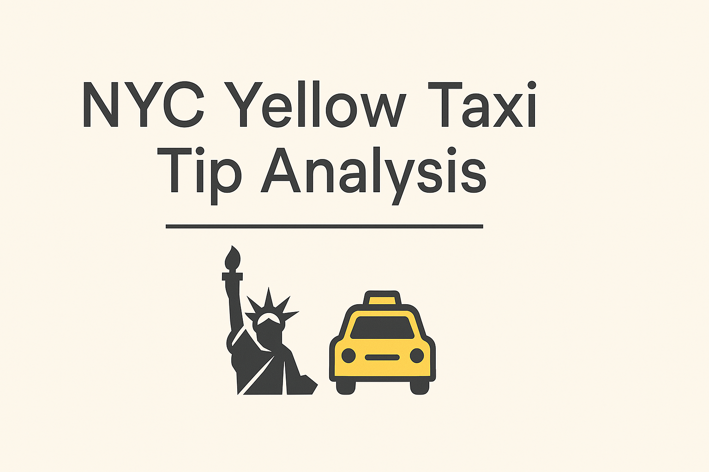
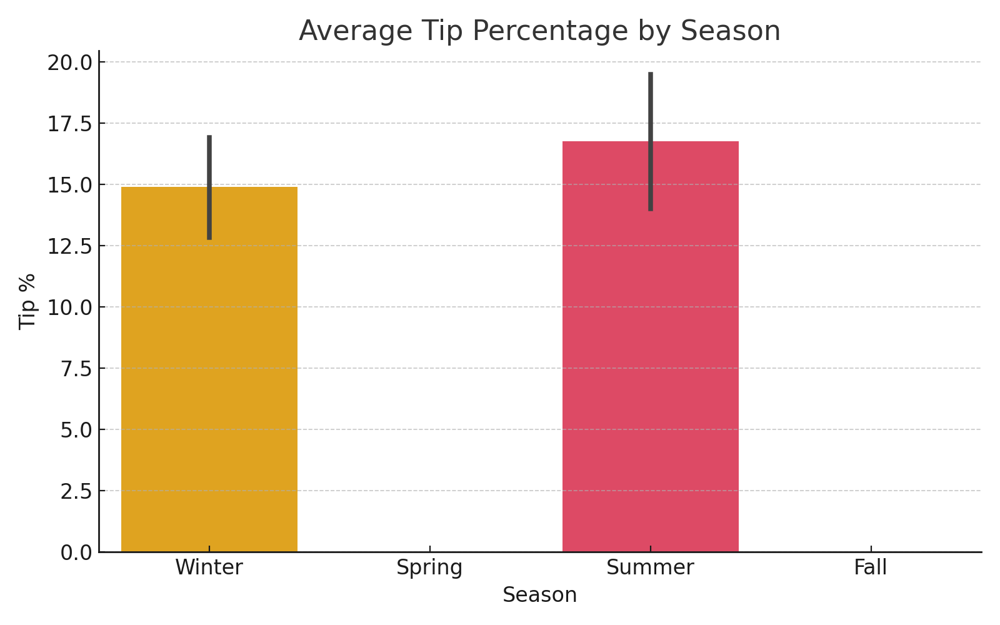
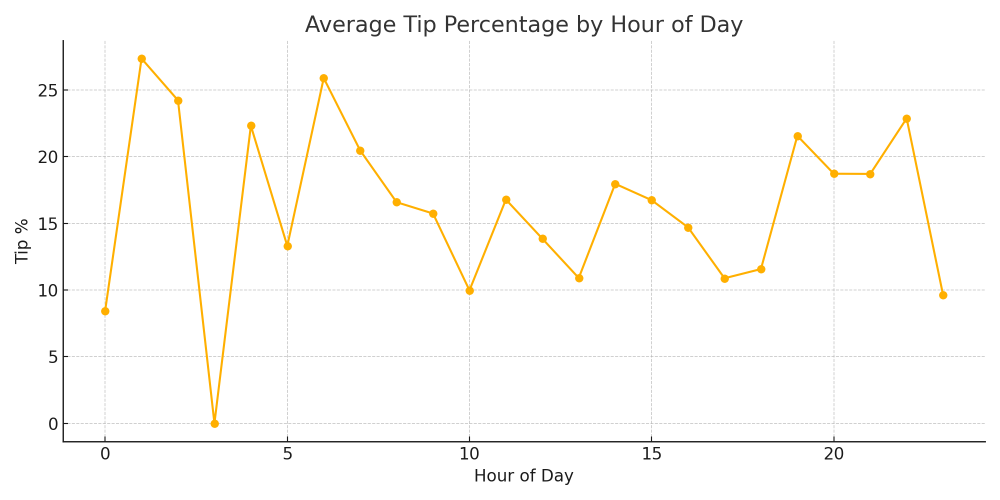
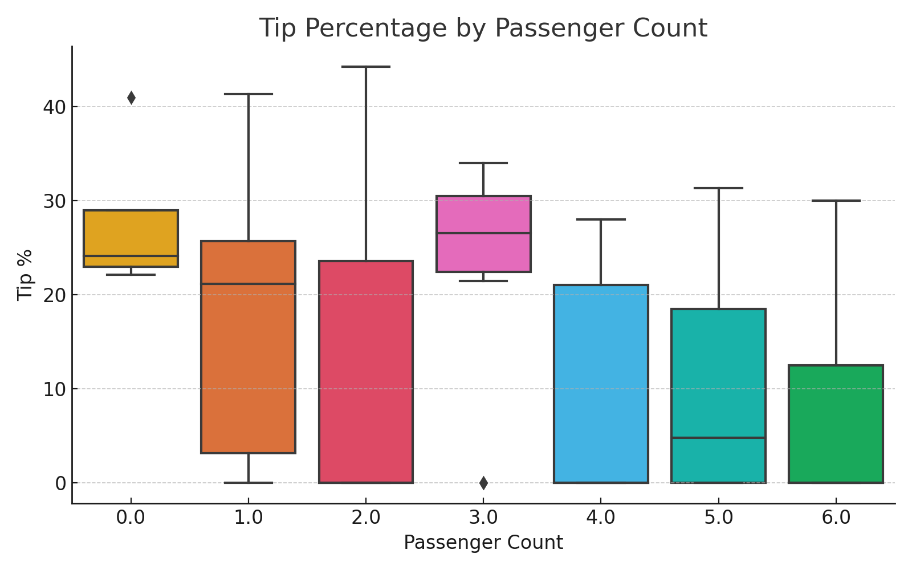
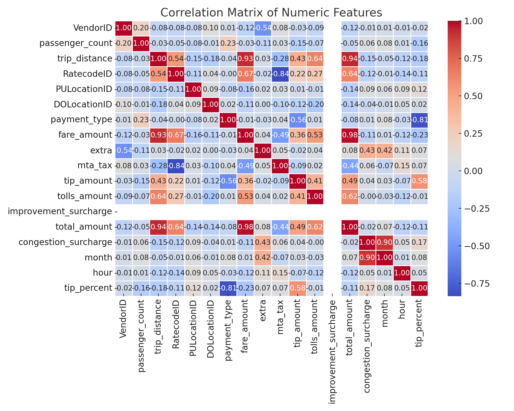
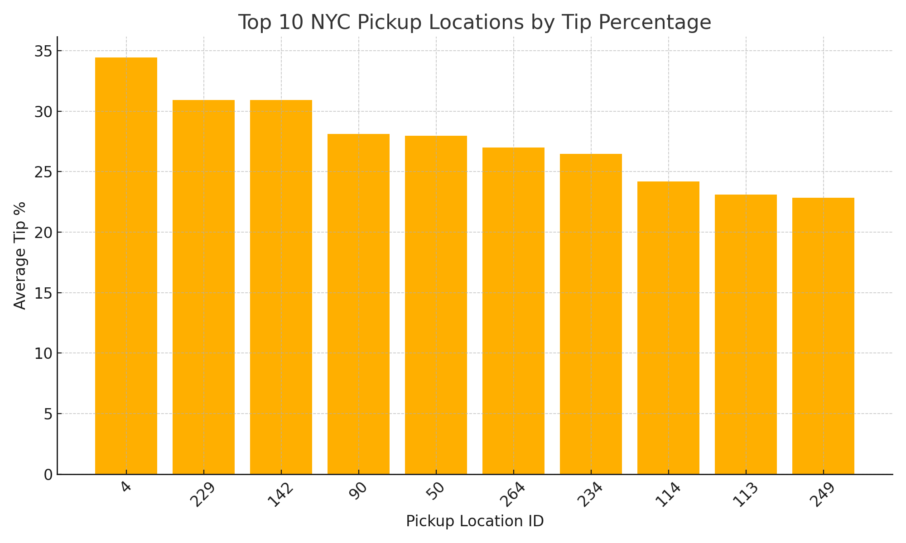

# NYC Yellow Taxi Tip Analysis

A data-driven look at how seasonality, passenger behavior, and trip factors affect tipping in NYC yellow cabs, using Python and visualization tools.

## 🔍 Analysis Summary

- 💰 Summer tips were slightly higher than winter, both in average dollar amount and percentage of fare.
- 🕒 Tip percentage varies by time of day, with some peak generosity hours.
- 👥 Passenger count affects tip patterns, with different distributions for solo vs. group rides.
- 📊 Feature correlations help uncover which variables influence tip behavior.
- 📍 Top tipping zones identified by pickup location.

---

### 📊 Tip % by Season

### 🕒 Tip % by Hour of Day

### 👥 Tip % by Passenger Count

### 🔥 Correlation Heatmap

### 📍 Tip % by Pickup Location

---

## 📁 Files

- `nyc_taxi_tip_analysis.ipynb`: Initial EDA on seasonal tipping behavior
- `eda_seasonal_tip_analysis.ipynb`: In-depth exploration of tipping influences and seasonal trends
- `taxi_cleaned.csv`: Sample dataset of 200 yellow taxi trips
- `charts/`: All project visuals and banner
- `requirements.txt`: Python libraries used

## 📊 Tools Used

- Python (Pandas, Matplotlib, Seaborn)
- Jupyter Notebook
- GitHub for version control

## 📌 Next Steps

- Expand dataset beyond 200 records for more robust conclusions
- Integrate NYC shapefile data for location-based mapping
- Overlay seasonal trends with external data like weather or events

---

Made with ❤️ by kpeaslee12
